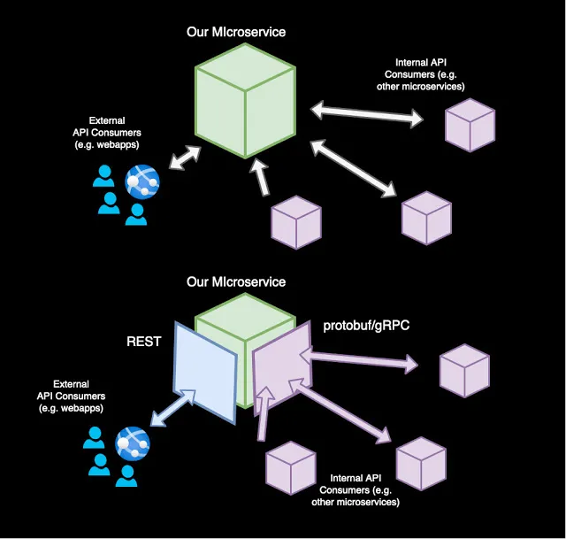

# BookStore-Protobuf-gRPC

## General Workflow



## Introduction
This project demonstrates the effective use of gRPC and Protobuf to facilitate communication between APIs developed in various languages and frameworks. It underscores the language-agnostic nature of this technology stack.

`gRPC` and `Protobuf` are key technologies in modern software engineering, especially in the context of microservices and distributed systems.

**gRPC (gRPC Remote Procedure Calls):** gRPC is an open-source remote procedure call system developed by Google. It allows a client application to directly call methods on a server application as if it were a local object. It is based on HTTP/2 for transport, uses Protocol Buffers as the interface description language, and provides features like authentication, load balancing, and more. gRPC is known for its high performance and efficiency, and it supports multiple programming languages, making it highly versatile for cross-language development.

**Protocol Buffers (Protobuf):** Developed by Google, Protobuf is a method for serializing structured data, similar to XML or JSON but more efficient as the data is in `Binary Format`. It's smaller, faster, and simpler than XML and JSON. Protobuf not only helps in defining a structured data schema but also automatically generates code to read and write the structured data to and from different data streams in a variety of languages.

The combination of gRPC and Protobuf is particularly useful because:

**1. Efficiency:** gRPC with Protobuf allows for efficient communication between services, with Protobuf ensuring minimal overhead in data serialization and deserialization.

**2. Cross-Language Support:** They support a wide range of programming languages, enabling seamless communication in a multi-language environment.

**3. Strong Typing and Schema Evolution:** Protobuf ensures that the structure of the data is well-defined and can evolve over time without breaking deployed programs.

**4. High-Performance Communication:** gRPC is designed for low-latency and high-throughput communication, making it ideal for microservices and distributed systems.

This combination is widely used in microservices architectures, where different services might be written in different languages but need to communicate efficiently, reliably and Fast.

## Objective
The primary goal is to illustrate how gRPC and Protobuf can be used together for efficient API communication across different development environments, showcasing the versatility and language independence of these technologies.

## Features
- **gRPC Integration:** Utilizes gRPC for efficient, low-latency communication between services.
- **Protobuf Serialization:** Employs Protobuf for compact, efficient data serialization.
- **Multi-language Support:** Demonstrates compatibility across different programming languages and frameworks.

## Getting Started

To run this project locally, you will need to run the `server` first such that it is ready to accept requests from the `client`. 
The `client` will then be able to send requests to the `server` and receive responses. 

gRPC does aid a `two-way communication` between the `client` and the `server` but for the sake of simplicity,
this project only demonstrates a one way communication from the `client` to the `server`.

As we are using `Protobuf`, we need to generate the code for the `client` and the `server` to use. 
Protobuf provides a compiler that is language agnostic and can generate code for any language. 
For sake of simplicity, we will be using Python for both the `client` and the `server`.

### Server Setup (Python)
1. cd into the server directory:
    ```bash
    cd server
    ```
2. Install required packages:
    ```bash
    pip install -r requirements.txt
    ```
3. Run the server:
    ```python
    python server.py
    ```

### Client Setup (Python)
1. Install Python 3.7 or higher.
2. Install the required packages:
    ```bash
    pip install -r requirements.txt
    ```
3. Run the client:
    ```python
    python client.py
    ```

## Usage
You can update the `client.py` file to send different requests to the `server` and receive responses.
As of now the `client` sends a request to the `server` to do the following operations:
- Add a book to the book store.
- Get a book from the book store.
- Delete a book from the book store.
- List all the books in the book store.
- Get book by id from the book store.
- Delete a specific book by id from the book store.

You can Add more to the functionality, but you will need to update the Proto file and generate the code for the `client` and the `server` to use.

To add a functionality update the `BookStore.proto` file and then run the following command to generate the code for the `client` and the `server` to use:
```bash
python -m grpc_tools.protoc -I. --python_out=. --grpc_python_out=. BookStore.proto
```

Make sure to copy the generated files to both `client` and `server` directories.

As we are using python we only need to generate the code for python but if you are using a different language then you will need to generate the code for that language as well.

## Contribution
Guidelines for contributing to the project.

### Issues
Issues are created to keep track of tasks, enhancements, and bugs for the project.

### Pull Requests
Pull Requests are created to merge changes from one branch to another branch.

## License
This project is licensed under the MIT License - see the [LICENSE](LICENSE) file for details.

## Acknowledgments
Sameer Shanbhag - [LinkedIn](https://www.linkedin.com/in/sameershanbhag/)

## Contact
Sameer Shanbhag - [Email](mailto:sameershanbhag14@gmail.com) - [LinkedIn](https://www.linkedin.com/in/sameershanbhag/)